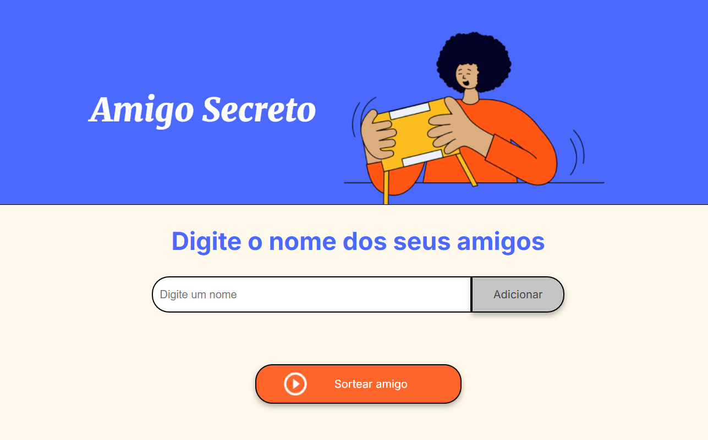
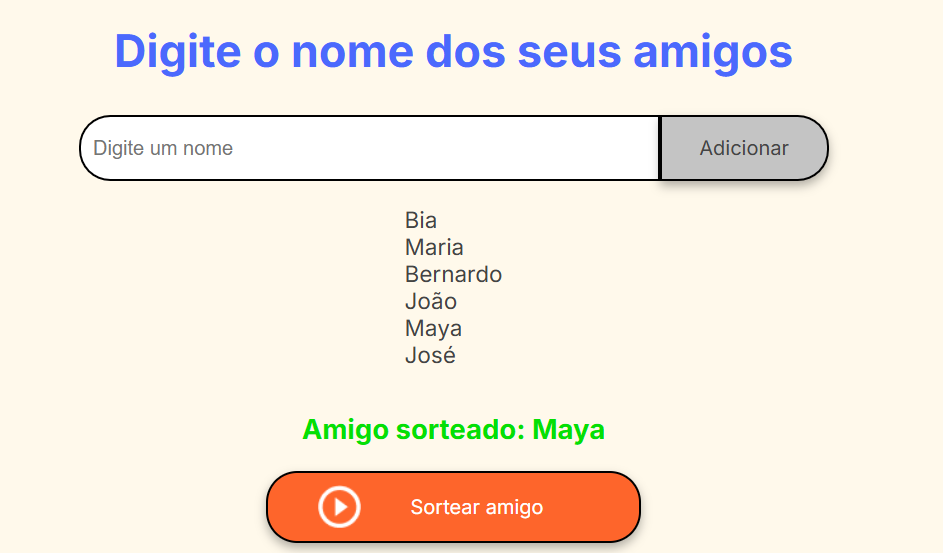
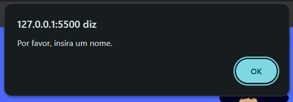

# Challenge Amigo Secreto

Neste projeto você pode adicionar nomes de amigos e realizar o sorteio de maneira aleatória. O objetivo é facilitar a realização do sorteio para eventos de amigo secreto.

## Funcionalidades

- **Adicionar nomes**: Os usuários podem adicionar nomes de amigos à lista, digitando-os em um campo de texto e clicando no botão "Adicionar".
- **Validar entrada**: Se o campo de texto estiver vazio, um alerta será exibido pedindo para o usuário inserir um nome válido.
- **Visualizar a lista de amigos**: Todos os nomes adicionados aparecerão em uma lista visível na tela.
- **Sorteio aleatório**: Ao clicar no botão "Sortear Amigo", o sistema sorteia aleatoriamente um dos amigos da lista e exibe o nome sorteado na página.

## Como Usar

1. **Adicionar amigos**: Digite o nome de um amigo no campo de entrada e clique em "Adicionar". O nome será adicionado à lista de amigos.
2. **Sortear amigo**: Quando estiver pronto para fazer o sorteio, clique no botão "Sortear Amigo". O nome de um amigo será sorteado aleatoriamente e exibido na tela.

## Tecnologias Utilizadas

- HTML
- CSS
- JavaScript

## Capturas de Tela



*Captura de tela mostrando a interface de adicionar amigos e realizar o sorteio.*



*Captura de tela mostrando o sorteio realizado.*



*Captura de tela mostrando o erro que é exibido ao tentar inserir um nome vazio.*

## Instalação

1. Clone o repositório:

   ```bash
   git clone https://github.com/janicecaldeira/challenge-amigo-secreto.git
   ```

2. Navegue até o diretório do projeto:

   ```bash
   cd challenge-amigo-secreto
   ```

3. Abra o arquivo `index.html` em seu navegador.

## Licença

Este projeto está licenciado sob a Licença MIT - veja o arquivo [LICENSE](LICENSE) para mais detalhes.

## Agradecimentos

Este projeto foi desenvolvido como parte do desafio de #AluraLatam e #oraclenexteducation
